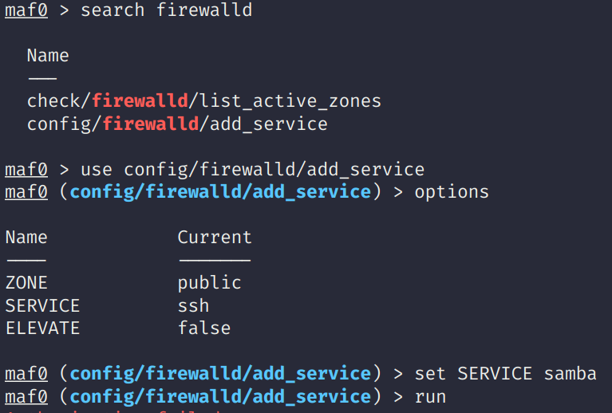

# Metadmin

  

  

Metadmin is a framework similar to Metasploit but for SysAdmin-type tasks.
There are many commands that even as an experienced engineer are hard to
remember and need googling from often. Metadmin allows search for common
commands, configuring them and running.

I would often created dozens of scripts to manage my systems but I never really
found a way to organise them until I found Metasploit and I thought it was an
interesting way of gathering an arbitrary number of scripts and being able to
use them without having to remember each script's command line arguments
without having to install bloated tools such as Jenkins.

There aren't many modules for now but will be adding them progressively.

## Install

From now just `git clone` and `./mafconsole`. Packages will come soon.

## How to use

If you are familiar on how to use Metasploit, Metadmin will work the same. The
main commands are:

- `options`
- `run`
- `search`
- `set`

Detailed instructions coming soon.

## Adding modules

All modules are inside `lib/metadmin/modules`. If you create any directory
inside there and add a module, it will pick it up. Generally, modules are shell
scripts that have the following:

- several environment variables set
- environment variable `options` contains the names of all of the environment
  variables in use from that module
- a `run` function that runs the main commands
- it is expected that `run` the main takeaways from the command with `_log_err`,
  `_log_warning` and `_log_info` without the user having to read the full
  command output.

An example of a module is in `share/metadmin/module-template`.

**Pull requests are accepted for new modules.**

