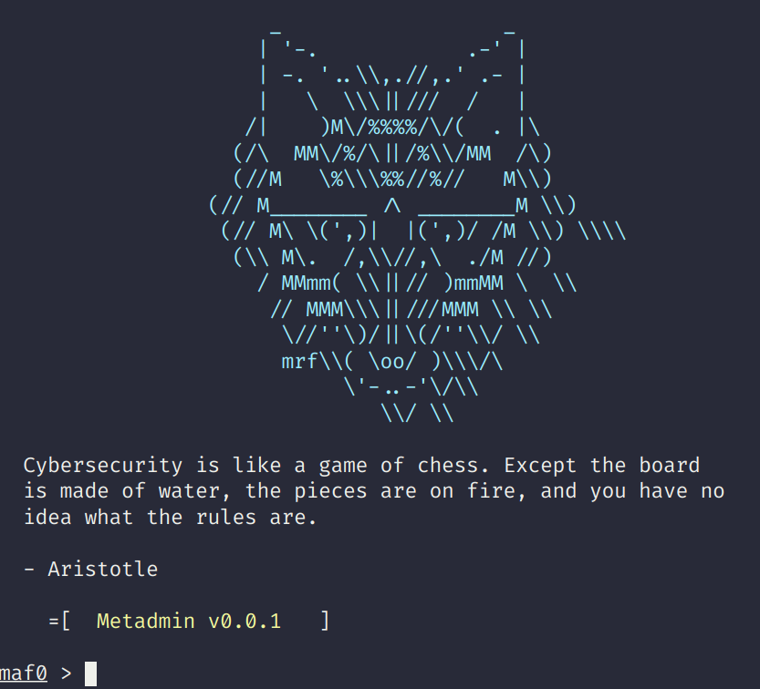

# Metadmin

  

Metadmin is a framework similar to Metasploit but for SysAdmin-type tasks.
There are many commands that even as an experienced engineer are hard to
remember and need googling from often. Metadmin allows search for common
commands, configuring them and running.

I would often created dozens of scripts to manage my systems but I never really
found a way to organise them until I found Metasploit and I thought it was an
interesting way of gathering an arbitrary number of scripts and being able to
use them without having to remember each script's command line arguments
without having to install bloated tools such as Jenkins.

## Install

From now just `git clone` and `./mafconsole`. Packages will come soon.

## How to use

If you are familiar on how to use Metasploit, Metadmin will work the same. The
main commands are:

- `options`
- `run`
- `search`
- `set`

Detailed instructions coming soon.

